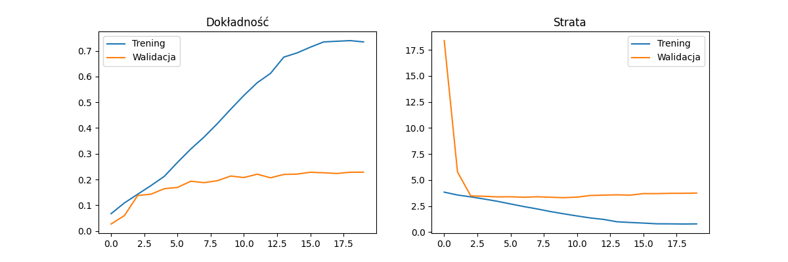

# Model sztucznej inteligencji do rozpoznawania gatunku rośliny po zdjęciu

## Ilość klas: 47
## Ilość zdjęć: 14 620

## Podział na zbiór do treningu / walidacji: 8 / 2

## Obecne wyniki programu:

## Wykres:

## Wprowadzone zmiany:

# Wczytywania i dzielenia danych:
Dane są wczytywane jako całość, a podział na trening/walidację odbywa się ręcznie przy użyciu .take() i .skip()

# Augmentacji i normalizacja
Augmentacja jest wykonywana po normalizacji. Dodatkowo dodano chache i shuffle

# Architektura modelu
- Dodano Dropout(0.4)
- Dodano BatchNormalization()
- Zwiększono warstwę Dense do 256 neuronów

# Callbacki
Dodano callbacki:
- EarlyStopping 
- ModelCheckpoint
- ReduceLROnPlateau